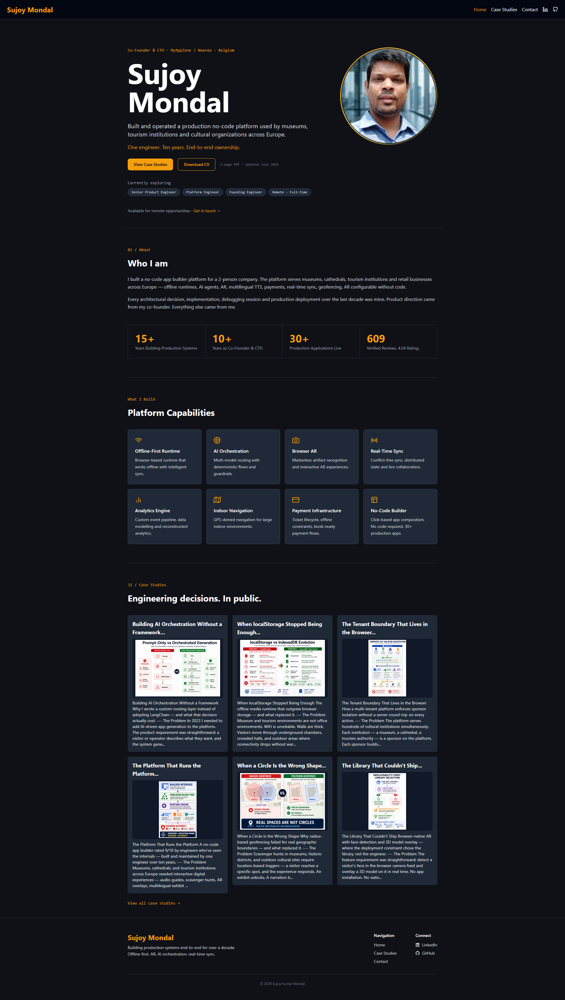
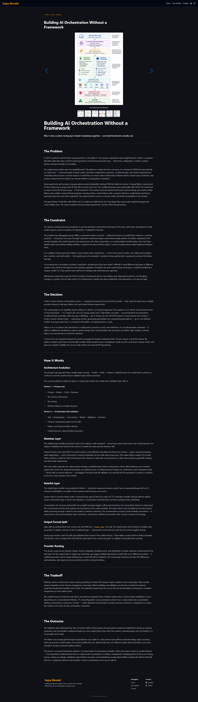
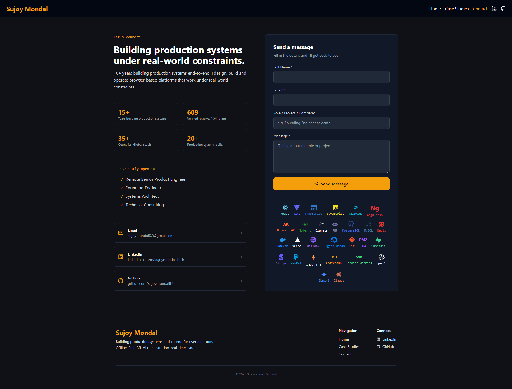
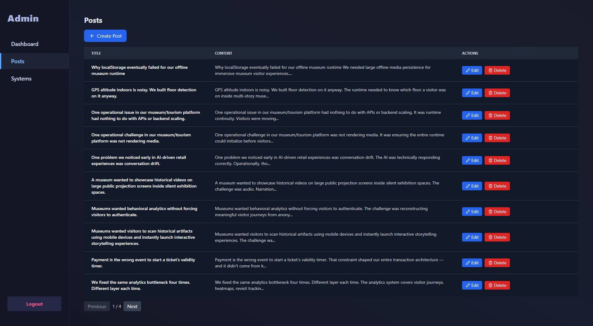

# Engineering Portfolio & Case Study Platform

> A full-stack portfolio platform built to document production architecture, runtime systems, and engineering decisions from 15+ years of software development. Case studies are written and published through a custom admin panel — no static site generator, no third-party CMS.

**Live:** https://sujoymondal-tech.vercel.app

---

## Screenshots

### Home


### Case Study


### Contact


### Admin Panel


---

## What this is

A production-grade portfolio and publishing platform — built from scratch, not assembled from a template. Case studies are authored through a protected admin panel, stored in Supabase PostgreSQL, and rendered on the frontend with full SEO metadata per page.

The platform serves as both a professional portfolio and a live demonstration of full-stack engineering — authentication, content management, image storage, SEO, and CI/CD all running in production.

---

## Features

- **Case study publishing** — markdown-supported long-form engineering writeups with cover images
- **Admin panel** — protected routes with Supabase Auth, create/edit/delete posts and systems
- **Image upload** — direct to Supabase Storage, served via CDN
- **SEO per page** — meta tags, Open Graph, Twitter Card, JSON-LD structured data, sitemap.xml, robots.txt, Google Search Console indexed
- **Platform capabilities showcase** — 8 production system categories documented (Offline-First, AI Orchestration, Browser AR, Real-Time Sync, Analytics, Indoor Navigation, Payments, No-Code Builder)
- **Contact form** — connected to backend via Resend email API
- **Mobile responsive**
- **Git-based CI/CD** — Vercel auto-deploys frontend, Render auto-deploys backend on push to main

---

## Stack

| Layer | Technology |
|---|---|
| Frontend | React 18 · Vite · TypeScript · Tailwind CSS |
| Backend | Node.js · Express · TypeScript |
| Database | Supabase PostgreSQL |
| Auth | Supabase Auth |
| Storage | Supabase Storage |
| Email | Resend |
| Deploy (frontend) | Vercel |
| Deploy (backend) | Render |

---

## Quick start

**Prerequisites:** Node.js >= 22 · npm >= 10

```bash
git clone https://github.com/sujoymondal87/engineering-portfolio
cd engineering-portfolio

# Backend
cd backend
cp .env.example .env   # fill in Supabase + Resend credentials
npm install
npm start

# Frontend (separate terminal)
cd frontend
cp .env.example .env   # set VITE_API_URL=http://localhost:3000
npm install
npm run dev
```

---

## Environment variables

### Backend (Render)

| Key | Required | Description |
|---|---|---|
| `SUPABASE_URL` | Yes | From Supabase project settings |
| `SUPABASE_SERVICE_KEY` | Yes | Service role key |
| `RESEND_API_KEY` | Yes | For contact form emails |
| `PORT` | No | Default 3000 |
| `NODE_VERSION` | Render only | 22.11.0 |

### Frontend (Vercel)

| Key | Required | Description |
|---|---|---|
| `VITE_API_URL` | Yes | Backend URL |

---

## Deployment

### Frontend (Vercel)
| Setting | Value |
|---|---|
| Root directory | `frontend` |
| Build command | `npm run build` |
| Output directory | `dist` |

### Backend (Render)
| Setting | Value |
|---|---|
| Root directory | `backend` |
| Build command | `npm install` |
| Start command | `npm start` |

---

## Production context

Built to document 10 years of solo engineering on Neareo/MyAppZone — a no-code app platform serving museums, cultural institutions, and tourism organisations across Spain, France, and Belgium. The platform runs 30+ live applications with 600+ verified reviews from users across 35+ countries.

Every case study on this site documents a real production decision — the constraint, the tradeoff, the outcome.

---

## License

MIT
